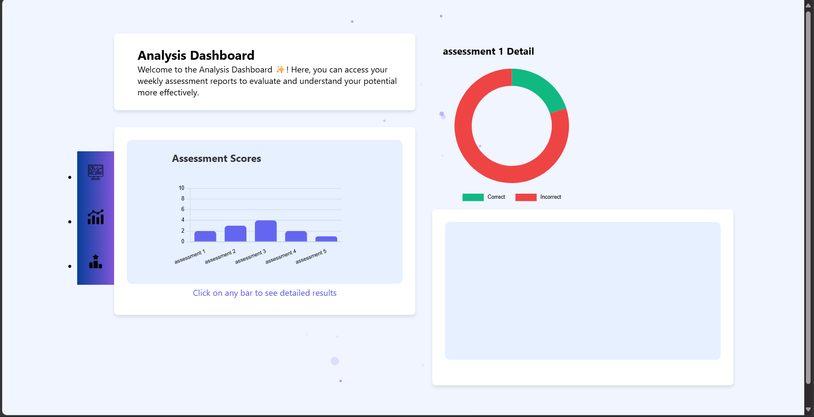

# Goal Track

A web application designed for college students to achieve career goals by providing **personalized learning paths**, **daily tasks**, **progress tracking**, and **AI-driven recommendations**.

## 🚀 Features
- **Career Path Selection**: Choose from:
  1. High-paying, in-demand roles in trending domains
  2. Jobs in domains of interest
  3. Roles based on existing skills
  4. Specific job titles
- **Milestone-based Learning**: Breaks career paths into achievable steps.
- **AI Recommendations**: Adjusts learning paths based on user activity.
- **Assessments**: Topic-based quizzes with feedback.
- **Reports**: Weekly and monthly performance analytics.
- **Path Correction**: Guides students back on track if they deviate.

## Screeshots

<table>
  <tr>
    <td></td>
    <td></td>
    <td></td>
  </tr>
  <tr>
    <td></td>
    <td></td>
    <td></td>
  </tr>
  <tr>
    <td></td>
    <td></td>
  </tr>
</table>

## 🛠 Tech Stack
- **Frontend**: HTML, CSS
- **Backend**: Flask (Python)  
- **Database**: MySQL  
- **AI/ML**: Integrated for recommendations & path corrections

## 📌 Usage

1. Sign up or log in.
2. Choose a career path.
3. Follow daily tasks and assessments.
4. Track your progress and adjust learning with AI suggestions.

## Authors

**Sowndappan S**

**Mythili S**

## Contributors

**Praveen G**

**Kathirvel M**

**Varsini**
